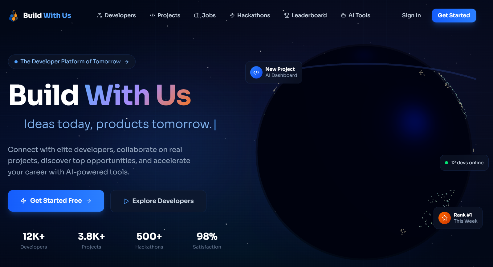

<div align="center">

# 🚀 BuildWithUs Frontend

A modern developer collaboration platform frontend built with **React 19**, **TypeScript**, **Vite**, **Tailwind CSS**, **React Query**, **Zustand**, **Framer Motion**, and **Three.js**.

BuildWithUs helps developers discover projects, find collaborators, explore jobs and hackathons, manage profiles, use AI tools, and access dashboard/admin features from a clean responsive UI.

</div>

---

## 📌 Project Overview

This repository contains only the **frontend client** of BuildWithUs. It communicates with a backend REST API using Axios and JWT authentication.

### Main Features

- Beautiful landing page with animated hero, 3D/particle UI and feature sections
- User authentication: sign in, sign up, forgot password, OAuth callback handling
- JWT token storage and automatic refresh-token flow
- Public pages for developers, projects, jobs, hackathons, team finder and leaderboard
- Protected dashboard routes for profile, projects, AI chat, AI code review, notifications and settings
- Admin dashboard routes protected by role-based checks
- API state management with TanStack React Query
- Global auth state with Zustand persist middleware
- Toast notifications using Sonner
- Reusable UI components like cards, buttons, modals, badges, skeletons and empty states

---

## 🖼️ Frontend Screenshots

> Add more screenshots in the `screenshots/` folder and update the paths below.

### Home / Landing Preview

### 🏠 Home Page
<p align="center">
  
</p>

Recommended screenshot list for GitHub README:

| Page | Suggested File Name |
|---|---|
| Home Page | `screenshots/home-page.png` |
| Sign In Page | `screenshots/sign-in-page.png` |
| Sign Up Page | `screenshots/sign-up-page.png` |
| Dashboard | `screenshots/dashboard-page.png` |
| Developers Page | `screenshots/developers-page.png` |
| Projects Page | `screenshots/projects-page.png` |
| Jobs Page | `screenshots/jobs-page.png` |
| AI Chat Page | `screenshots/ai-chat-page.png` |
| AI Code Review Page | `screenshots/code-review-page.png` |

---

## 🛠️ Tech Stack

| Category | Technology |
|---|---|
| Framework | React 19 |
| Language | TypeScript |
| Build Tool | Vite 7 |
| Styling | Tailwind CSS 4 |
| Routing | React Router DOM 7 |
| API Client | Axios |
| Server State | TanStack React Query |
| Client/Auth State | Zustand |
| Forms | React Hook Form |
| Validation | Zod |
| Animations | Framer Motion, GSAP |
| 3D UI | Three.js, React Three Fiber, Drei |
| Charts | Recharts |
| Icons | Lucide React |
| Toasts | Sonner |
| Linting | ESLint |

---

## 📁 Folder Structure

```txt
BuildWithUs-Frontend-main/
├── public/
│   ├── uploads/
│   │   └── upload_1.png
│   └── vite.svg
├── src/
│   ├── assets/
│   │   └── react.svg
│   ├── components/
│   │   ├── 3d/
│   │   │   ├── Earth.tsx
│   │   │   └── ParticleField.tsx
│   │   ├── home/
│   │   │   ├── AISection.tsx
│   │   │   ├── CTASection.tsx
│   │   │   ├── FeaturesSection.tsx
│   │   │   ├── HeroSection.tsx
│   │   │   ├── HowItWorksSection.tsx
│   │   │   ├── StatsSection.tsx
│   │   │   └── TestimonialsSection.tsx
│   │   ├── layout/
│   │   │   ├── DashboardLayout.tsx
│   │   │   ├── Footer.tsx
│   │   │   └── Navbar.tsx
│   │   └── ui/
│   │       ├── Avatar.tsx
│   │       ├── Badge.tsx
│   │       ├── EmptyState.tsx
│   │       ├── GlassCard.tsx
│   │       ├── GlowButton.tsx
│   │       ├── LoadingSkeleton.tsx
│   │       ├── Modal.tsx
│   │       └── SectionWrapper.tsx
│   ├── hooks/
│   │   └── useAuth.ts
│   ├── lib/
│   │   ├── axios.ts
│   │   └── utils.ts
│   ├── pages/
│   │   ├── admin/
│   │   │   └── AdminDashboard.tsx
│   │   ├── auth/
│   │   │   ├── ForgotPasswordPage.tsx
│   │   │   ├── SignInPage.tsx
│   │   │   └── SignUpPage.tsx
│   │   ├── dashboard/
│   │   │   ├── AIChatPage.tsx
│   │   │   ├── AICodeReviewPage.tsx
│   │   │   ├── NotificationsPage.tsx
│   │   │   ├── ProfileEditPage.tsx
│   │   │   ├── ProjectsCreatePage.tsx
│   │   │   ├── SettingsPage.tsx
│   │   │   └── VerificationPage.tsx
│   │   ├── DashboardPage.tsx
│   │   ├── DeveloperProfilePage.tsx
│   │   ├── DevelopersPage.tsx
│   │   ├── HackathonsPage.tsx
│   │   ├── HomePage.tsx
│   │   ├── JobsPage.tsx
│   │   ├── LeaderboardPage.tsx
│   │   ├── OAuthCallbackPage.tsx
│   │   ├── ProjectsPage.tsx
│   │   └── TeamFinderPage.tsx
│   ├── services/
│   │   ├── admin.service.ts
│   │   ├── aiChat.service.ts
│   │   ├── auth.service.ts
│   │   ├── codeReview.service.ts
│   │   ├── follow.service.ts
│   │   ├── hackathon.service.ts
│   │   ├── jobs.service.ts
│   │   ├── leaderboard.service.ts
│   │   ├── notifications.service.ts
│   │   ├── profile.service.ts
│   │   ├── projects.service.ts
│   │   └── verification.service.ts
│   ├── store/
│   │   └── authStore.ts
│   ├── types/
│   │   └── index.ts
│   ├── App.css
│   ├── App.tsx
│   ├── index.css
│   └── main.tsx
├── .env
├── eslint.config.js
├── index.html
├── package.json
├── tsconfig.app.json
├── tsconfig.json
├── tsconfig.node.json
└── vite.config.ts
```

---

## ⚙️ Environment Variables

Create a `.env` file in the frontend root.

```env
# Backend REST API base URL
VITE_API_BASE_URL=http://localhost:8080/api/v1

# Backend base URL for OAuth redirects
VITE_BACKEND_BASE_URL=http://localhost:8080

# Frontend OAuth callback route
VITE_OAUTH_CALLBACK_URL=http://localhost:5173/oauth2/redirect

# Optional analytics
VITE_GA_TRACKING_ID=

# Optional Cloudinary upload values
VITE_CLOUDINARY_CLOUD_NAME=
VITE_CLOUDINARY_UPLOAD_PRESET=
```

### Important Notes

- Vite environment variables must start with `VITE_`.
- Do not commit real production secrets.
- The frontend expects backend responses in a wrapper format like:

```json
{
  "success": true,
  "message": "Request successful",
  "data": {}
}
```

The Axios interceptor unwraps `data` automatically.

---

## 🚀 Local Setup

### 1. Clone the Repository

```bash
git clone <your-frontend-repo-url>
cd BuildWithUs-Frontend-main
```

### 2. Install Dependencies

```bash
npm install
```

### 3. Configure Environment

```bash
cp .env.example .env
```

If `.env.example` is not available, create `.env` manually using the environment variables shown above.

### 4. Start Development Server

```bash
npm run dev
```

Frontend will run at:

```txt
http://localhost:5173
```

### 5. Build for Production

```bash
npm run build
```

### 6. Preview Production Build

```bash
npm run preview
```

### 7. Run Lint

```bash
npm run lint
```

---

## 📜 Available Scripts

| Command | Description |
|---|---|
| `npm run dev` | Start Vite development server |
| `npm run build` | Type-check and create production build |
| `npm run preview` | Preview production build locally |
| `npm run lint` | Run ESLint checks |

---

## 🧭 Application Routes

### Public Routes

| Route | Page |
|---|---|
| `/` | Home page |
| `/developers` | Developer listing |
| `/developers/:username` | Developer public profile |
| `/projects` | Project listing |
| `/jobs` | Job listing |
| `/hackathons` | Hackathon listing |
| `/team-finder` | Team finder page |
| `/leaderboard` | Leaderboard page |

### Auth Routes

| Route | Page |
|---|---|
| `/auth/sign-in` | Sign in page |
| `/auth/sign-up` | Sign up page |
| `/auth/forgot-password` | Forgot password page |
| `/oauth2/redirect` | OAuth callback page |

### Protected Dashboard Routes

These routes require a valid access token and stored user data.

| Route | Page |
|---|---|
| `/dashboard` | User dashboard |
| `/dashboard/profile` | Current user profile |
| `/dashboard/profile/edit` | Edit profile |
| `/dashboard/projects` | User projects |
| `/dashboard/projects/create` | Create project |
| `/dashboard/jobs/saved` | Saved jobs |
| `/dashboard/code-review` | AI code review |
| `/dashboard/ai-chat` | AI chat |
| `/dashboard/verification` | Verification request/status |
| `/dashboard/hackathons` | Dashboard hackathons |
| `/dashboard/team-posts` | Team posts |
| `/dashboard/notifications` | Notifications |
| `/dashboard/settings` | Settings |
| `/dashboard/following` | Following list |
| `/dashboard/followers` | Followers list |
| `/dashboard/collaborations` | Collaborations |

### Admin Routes

Admin routes require authenticated user data with `ADMIN` role.

| Route | Page |
|---|---|
| `/admin` | Admin dashboard |
| `/admin/users` | Admin users area |
| `/admin/jobs` | Admin jobs area |
| `/admin/verifications` | Verification management |
| `/admin/projects` | Admin projects area |
| `/admin/hackathons` | Admin hackathons area |

---

## 🔐 Authentication Flow

The app stores authentication data in local storage using these keys:

```txt
bwu_access_token
bwu_refresh_token
bwu_user
```

### Auth Handling

- Login/register responses save user and tokens through `authStore.ts`.
- Axios request interceptor attaches access token as:

```txt
Authorization: Bearer <access_token>
```

- If an API call returns `401`, Axios tries to refresh the token through:

```txt
POST /auth/refresh
```

- If refresh fails, local storage is cleared and the user is redirected to:

```txt
/auth/sign-in
```

---

## 🔌 API Service Layer

All backend calls are grouped inside `src/services/`.

| Service File | Responsibility |
|---|---|
| `auth.service.ts` | Login, register, logout, refresh, forgot password, current user |
| `profile.service.ts` | Profile read/update, photo upload, profile search |
| `projects.service.ts` | Project listing, details, create, update, delete, collaborate |
| `jobs.service.ts` | Jobs, saved jobs, featured jobs, job CRUD |
| `hackathon.service.ts` | Hackathons and team finder APIs |
| `follow.service.ts` | Follow/unfollow, followers, following, follow check |
| `leaderboard.service.ts` | Leaderboard and user badges |
| `notifications.service.ts` | Notifications, unread count, mark read, delete |
| `aiChat.service.ts` | AI chat conversations and messages |
| `codeReview.service.ts` | AI code review submit/history/details/delete |
| `verification.service.ts` | Verification request/status/admin review |
| `admin.service.ts` | Admin stats, users, blocks, jobs |

---

## 🧩 Important Components

### Layout Components

- `Navbar.tsx` — main navigation
- `Footer.tsx` — footer section
- `DashboardLayout.tsx` — dashboard wrapper/sidebar layout

### Home Page Sections

- `HeroSection.tsx`
- `FeaturesSection.tsx`
- `StatsSection.tsx`
- `HowItWorksSection.tsx`
- `AISection.tsx`
- `TestimonialsSection.tsx`
- `CTASection.tsx`

### Reusable UI Components

- `GlassCard.tsx`
- `GlowButton.tsx`
- `Modal.tsx`
- `Badge.tsx`
- `Avatar.tsx`
- `EmptyState.tsx`
- `LoadingSkeleton.tsx`
- `SectionWrapper.tsx`

---

## 🧠 State Management

### Zustand Auth Store

File:

```txt
src/store/authStore.ts
```

The auth store manages:

- Current user
- Access token
- Refresh token
- Authenticated state
- Loading state
- Login/logout helpers
- Persistent auth data

### React Query

`QueryClientProvider` is configured in `App.tsx` with:

```ts
staleTime: 1000 * 60 * 5
retry: 1
```

This means query data stays fresh for 5 minutes and failed queries retry once.

---

## 🎨 Styling Guide

The project uses Tailwind CSS with modern UI patterns:

- Glassmorphism cards
- Gradient backgrounds
- Glow buttons
- Animated sections
- Responsive layouts
- Dark theme style
- Reusable UI wrappers

Global styles are located in:

```txt
src/index.css
src/App.css
```

---

## 🧪 Recommended Testing Checklist

Before pushing changes, manually test:

- Home page loads correctly
- Navbar links route correctly
- Sign up page form works
- Sign in page stores token and user
- Protected routes redirect unauthenticated users
- Dashboard routes load after login
- OAuth callback handles `token`, `refreshToken`, and `error`
- Token refresh works after access token expiry
- Logout clears local storage
- Admin routes reject non-admin users
- Mobile responsive layout works
- Production build completes successfully

---

## 🐞 Common Issues & Fixes

### API calls failing with CORS error

Check backend CORS configuration and make sure frontend origin is allowed:

```txt
http://localhost:5173
```

### User redirects to sign-in repeatedly

Clear local storage and login again:

```js
localStorage.clear()
```

Then refresh the page.

### OAuth login returns error

Verify these values:

```env
VITE_BACKEND_BASE_URL=http://localhost:8080
VITE_OAUTH_CALLBACK_URL=http://localhost:5173/oauth2/redirect
```

Also make sure the backend OAuth redirect URI matches the frontend callback route.

### Build fails due to TypeScript errors

Run:

```bash
npm run build
```

Fix all TypeScript errors shown in the terminal before deployment.

### Blank page after deployment

Check:

- Browser console errors
- Correct API URL in `.env`
- SPA fallback routing on hosting provider
- Correct build output directory: `dist/`

---

## 🌍 Deployment

### Build Output

After running:

```bash
npm run build
```

Vite creates production files in:

```txt
dist/
```

### Deploy on Vercel

| Setting | Value |
|---|---|
| Framework Preset | Vite |
| Build Command | `npm run build` |
| Output Directory | `dist` |
| Install Command | `npm install` |

Add production environment variables in Vercel dashboard.

### Deploy on Netlify

| Setting | Value |
|---|---|
| Build Command | `npm run build` |
| Publish Directory | `dist` |

For SPA routing, add `_redirects` file in `public/`:

```txt
/* /index.html 200
```

---

## 🤝 Contribution Workflow

```bash
# 1. Fork the repository
# 2. Clone your fork
git clone <your-fork-url>

# 3. Create a new branch
git checkout -b feature/your-feature-name

# 4. Install dependencies
npm install

# 5. Start development server
npm run dev

# 6. Commit changes
git add .
git commit -m "feat: add your feature"

# 7. Push branch
git push origin feature/your-feature-name

# 8. Open Pull Request
```

---

## ✅ README Screenshot Setup

For best GitHub presentation:

1. Create this folder in your repository:

```txt
screenshots/
```

2. Add your frontend screenshots:

```txt
screenshots/home-page.png
screenshots/sign-in-page.png
screenshots/dashboard-page.png
screenshots/projects-page.png
```

3. Use this Markdown format:

```md

```

---

## 👨‍💻 Author & Contributors
  <a href="https://github.com/gitKeshav11/BuildWithUs/graphs/contributors">
    
  </a>
  
## 📞 Contact
### 👨‍💻 Keshav Upadhyay  
**🚀 Role:** Software Developer (Java & Spring Boot)  

📧 **Email:** [gitKeshav11@gmail.com](mailto:gitKeshav11@gmail.com)  
🔗 **LinkedIn:** [Keshav Upadhyay](https://www.linkedin.com/in/gitKeshav11/)  
🐙 **GitHub:** [gitKeshav11](https://github.com/gitKeshav11)  

---

<div align="center">

⭐ If you like this project, give it a star on GitHub!

</div>
